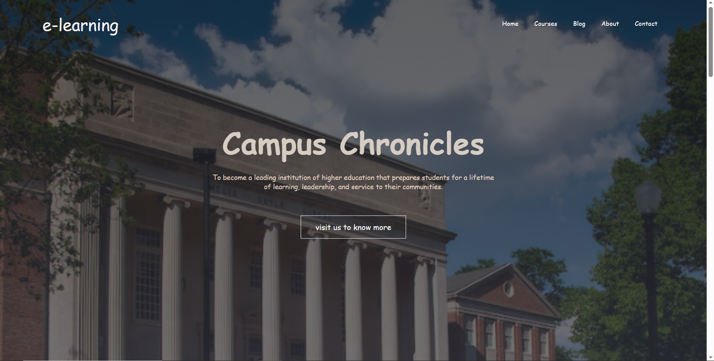

# College/University Website

Welcome to the official repository for the College/University website project! This website is built using HTML and CSS, focusing on creating a comprehensive and user-friendly online platform for an educational institution.

.
.

## Table of Contents

- [Getting Started](#getting-started)
- [Design and Responsiveness](#design-and-responsiveness)
- [Contributions](#contributions)
- [License](#license)

## Getting Started

To explore the website locally, follow these steps:

1. Clone the repository to your local machine using the following command:
git clone https://github.com/laibabintatahir/college-university-website.git

2. Navigate to the project directory

3. Open any of the HTML files in your preferred web browser to view different pages of the website.

## Design and Responsiveness

The website features a modern and clean layout with carefully selected fonts, colors, and images for an enhanced user experience. The design is responsive, ensuring optimal display on various screen sizes. Consistent design and intuitive navigation contribute to a seamless browsing experience.

## Contributions

Contributions to the project are welcome! If you'd like to contribute, please refer to the [contribution guidelines](CONTRIBUTING.md) for more details on bug fixes, enhancements, and additional features.

## License

This project is licensed under the [MIT License](LICENSE), allowing you to use, modify, and distribute the code as per the terms outlined in the license.

---

